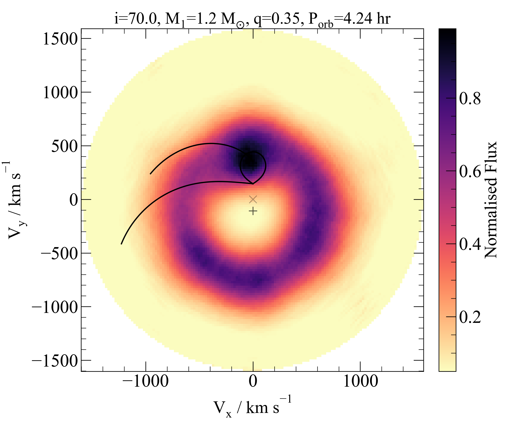

# PyDoppler

  This is the repository for a python wrapper for Henk Spruit's doppler tomography software.
  This code can produce a trail spectra of a dataset, and perform
  Doppler tomography maps. It is intended to be a light-weight code for
  single emission line datasets.
  The code will be able to:
  - [x] Load and normalise spectra
  - [x] Plot a trail spectra at initial phase resolution and binned
  - [x] Run Doppler tomography and plot reconstructed spectra
  - [ ] Perform initial spectra binning into user-defined phase bins
  - [ ] User-friendly functions
  - [ ] Auto-save figures.

  The original code and IDL interface can be found at:
   *  https://wwwmpa.mpa-garching.mpg.de/~henk/

  At the moment, there are many features that haven't been implemented. However, the code will be updated
  continuously. If you have any queries/comments/bug reports please send an e-mail to:
   * jvhs1 (at) st-andrews.ac.uk

  If you make use of this software, please acknowledge the original code and this repository:
   * Spruit 1998, arXiv, astro-ph/9806141 (https://ui.adsabs.harvard.edu/abs/1998astro.ph..6141S/abstract)

  ## Requirements & Installation

  The doppler tomography code is written in fortran. Please ensure that you have a fortran compiler installed.
  At the moment, only gfortran is supported.


  Python >3.0 version is required (No tests have been done for backwards compatibility with python 2.X).

  You can download and install PyDoppler via pip. In a terminal command line, just type:

  ```
  pip install pydoppler
  ```

  If you need to upgrade the package to the latest version, you can do this with
  ```
  pip install pydoppler -upgrade
  ```

  ##  Section 1:  Usage

  You can use the sample_script.py file to run all the relevant commands
  _shown in sections 2 and 3_ from a terminal command line as:
  ```
  python sample_scipt.py
  ```
  or in a python console:
  ```python
  run sample_scipt.py
  ```
  This will read all the files, normalise the spectra, perform Doppler
  tomography and output the results. In the following sections, I will briefly
  explain each main routine.

  ##  Section 2: How to load data

  ###  Section 2.1: Test case - the accreting white dwarf - U Gem

  You can start to test PyDoppler with a test dataset kindly provided by J. Echevarria and published
  in Echevarria et al. 2007, AJ, 134, 262 (https://ui.adsabs.harvard.edu/abs/2007AJ....134..262E/abstract).
  To copy the data to your working directory, open a (i)python console and run the
  following commands:
  ```python
  import pydoppler

  pydoppler.test_data()

  ```
  This will create a subdirectory (called ugem99) in your current working directory
  which will contain text files for each spectra (txtugem40*). The format of
  each spectrum file is two columns: _Wavelength_ and _Flux_.
  * Wavelength is assumed to be in Angstrom.
  * Don't use headers in the files or us a _#_ at the start of the line, so it
  will be ignored.

  In addition, a phase file (ugem0all.fas) will be added inside the ugem99
  directory which contains the name
  of each spectrum file and its corresponding orbital phase.
  This is a two column file with the following format:
```
  txtugem4004 0.7150
  txtugem4005 0.7794
         .
         .
         .
```

  ###  Section 2.2: Load your data
  I recommend to stick to the previous file format (as in the test dataset):

  * Individual spectra. Two-column files, _space separated_: Wavelength  Flux
  * Phase file. Two-column file, _space separated_: Spectrum_name  Orbital_Phase

  and the following directory tree in order for PyDoppler to work properly:

  ```
  wrk_dir
  ├── data_dir (your target)
  │   │
  │   ├── individual_spectra (N spectra)
  │   │
  │   └── phases_file
  │
  └── fortran_code_files
  ```

  ##  Section 3:  Doppler tomography tutorial
  Before running any routines, verify that you have added all the relevant
  parameters into the PyDoppler object.

  * _NOTE:_ The pydoppler.spruit() will also copy into the working directory
  a copy of a sample script (sample_scipt.py) with all the commands in the
  following tutorial. The code will add a new script (e.g. sample_scipt-1.py)
  if you use the "install_force=True" keyword, it will not overwrite the one
  found in the directory.

  ```python
  import pydoppler

  # Load base object for tomography
  dop = pydoppler.spruit()

  # Basic data for the tomography to work
  dop.object = 'U Gem'
  dop.base_dir = 'ugem99' # Base directory for input spectra
  dop.list = 'ugem0all.fas'		# Name of the input file
  dop.lam0 = 6562.8 # Wavelength zero in units of the original spectra
  dop.delta_phase = 0.003  # Exposure time in terms of orbital phase
  dop.delw = 35	# size of Doppler map in wavelength centred at lam0
  dop.overs = 0.3 # between 0-1, Undersampling of the spectra. 1= Full resolution
  dop.gama = 36.0  # Systemic velocity in km /s
  dop.nbins = 28  # Number of bins. Only supported the number of spectra at the moment
  ```

  ### Section 3.1: Read the data
  This routine reads in the raw data and prepares the files for further
  processing.
  ```python
  # Read in the individual spectra and orbital phase information
  dop.Foldspec()
  ```
  ```
  001 txhugem4004  0.715 2048
  002 txhugem4005  0.7794 2048
  003 txhugem4006  0.8348 2048
  004 txhugem4007  0.8942 2048
  005 txhugem4008  0.9518 2048
  006 txhugem4009  0.0072 2048
  007 txhugem4010  0.0632 2048
  008 txhugem4011  0.1186 2048
  009 txhugem4012  0.1745 2048
  010 txhugem4013  0.2344 2048
  011 txhugem4014  0.2904 2048
  012 txhugem4015  0.3724 2048
  013 txhugem4016  0.4283 2048
  014 txhugem4017  0.4866 2048
  015 txhugem4018  0.5425 2048
  016 txhugem4019  0.5979 2048
  017 txhugem4020  0.6544 2048
  018 txhugem4021  0.7098 2048
  019 txhugem4022  0.7652 2048
  020 txhugem4023  0.8195 2048
  021 txhugem4024  0.8772 2048
  022 txhugem4025  0.9269 2048
  023 txhugem4026  0.9614 2048
  024 txhugem4027  0.9959 2048
  025 txhugem4028  0.0304 2048
  026 txhugem4029  0.0648 2048
  027 txhugem4030  0.1027 2048
  028 txhugem4031  0.1372 2048
```

  ### Section 2.2: Normalise the data and set doppler files
  You will need to define a continnum band - one at each side of the emission line -
  to fit and later subtract the continuum. This normalised spectra will be put in
  in a file to be read by the fortran code.
  ```python  
  # Normalise the spectra
      dop.Dopin(continnum_band=[6500,6537,6591,6620],
      		 plot_median=False,poly_degree=2)
  ```


  <p align="middle">
     
     
  </p>

  ### Section 2.3: Run the fortran code
  Now, let's run the tomography software!
  ```python
  # Perform tomography
  dop.Syncdop()
  ```

  The output of the fortran code is:
  ```
  nvp 477
  (28, 477)
  nv 143 143
  Estimated Memory required  354  Mbytes
        parameter (nd=npm*nvpm,nr=0.8*nvm*nvm)

        parameter (nt=nvpm*npm+nvm*nvpm*3+2*npm*nvm)

        parameter (nri=0.9*nvm*nt/nd,ndi=0.9*nvm*nt/nr)

  c parameters for emap routines

        parameter (nf=nd,nfp=ndi,nrp=nri)

        parameter (ni=nvm,nj=nvm)

        parameter (nch=1,nsu=1)

  * Computing MEM tomogram
  cp -f cclock.f clock.f ; gfortran -O -w -o dopp dop.f clock.f
  dopp
  make: dopp: No such file or directory
  make: *** [dop.out] Error 1
   RL max entropy, floating defaults
   ih        0  (log likelihood)                      
   iw        0  (no error bars read in)               
   pb0,pb1 0.950 1.050
   ns        7
   ac      8.00E-04
   nim     150
   al0, alf, nal    0.0020 1.7000  -1
   clim   1.6000
   ipri    2
   norm    1
   wid, af   0.10E+07 1.0000
   HOLAQQ NOW 2Q
   cpu for geometry      0.19
   HOLAQQQQ
   it      H+alfa*S        delta
     1  3.064384039127E+04   8.97E-01
     2  3.124296879919E+04   8.88E-01
     3  3.174029201244E+04   8.10E-01
     4  3.187324638623E+04   6.27E-01
     5  3.189338120949E+04   4.84E-01
     6  3.189804389182E+04   3.63E-01
     7  3.189972657354E+04   2.60E-01
     8  3.190005031439E+04   2.13E-01
     9  3.190020880677E+04   1.65E-01
    10  3.190026635720E+04   1.43E-01
    11  3.190030859976E+04   1.14E-01
    12  3.190032174052E+04   9.00E-02
    13  3.190032685539E+04   7.44E-02
    14  3.190032853609E+04   5.82E-02
    15  3.190032918090E+04   4.18E-02
    16  3.190032942768E+04   2.94E-02
    17  3.190032951013E+04   2.23E-02
    18  3.190032954797E+04   1.53E-02
    19  3.190032956032E+04   1.32E-02
    20  3.190032956654E+04   9.57E-03
    21  3.190032956866E+04   5.22E-03
    22  3.190032956935E+04   1.92E-03
    23  3.190032956960E+04   2.18E-03
    24  3.190032956968E+04   8.18E-04
    25  3.190032956971E+04   4.46E-04
   ni, al, hs, rr:   25 0.00200  0.319003296E+05 1.48261 1.60000
   cpu for iteration    0.81
   entropy -2.4072E+04
  ```
  ### Section 2.4: Plot the tomography map
  This routine will display the outcome of the Doppler tomography. You can overplot
  contours and streams.
  ```python
  # Read and plot map
  cb,data = dop.Dopmap(limits=[0.05,0.99],colorbar=True,cmaps=cm.mamga_r,
  					smooth=False,remove_mean=False)
  # Overplot the donor contours, keplerian and ballistic streams
  qm=0.35   # mass ratio M_2 / M_1
  k1 = 107  # Semi amplitude of the primary in km/s
  inc=70    # inclination angle, in degrees
  m1=1.2    # Mass of the primary in solar masses
  porb=0.1769061911  # orbital period in days


  pydoppler.stream(qm,k1,porb,m1,inc)
  ```
  <p align="middle">
     
  </p>

  ### Section 2.5: Spectra reconstruction
  Always check that reconstructed spectra looks like the original one. A good
  rule of thumb "If a feature on the Doppler tomogram is not in the trail
  spectrum, most likely its not real!"

  ```python
  # plot trail spectra
  cb2,cb3,dmr = dop.Reco(colorbar=True,limits=[.05,0.95],cmaps=cm.magma_r)
  ```
  <p align="middle">
     
  </p>

  ## Section 3: Troubleshoot
  This is an early version of the wrapper. Things will go wrong. If you find a
  bug or need a feature, I will try my best to work it out. If you think you can
  add to this wrapper, I encourage you push new changes and contribute to it.
